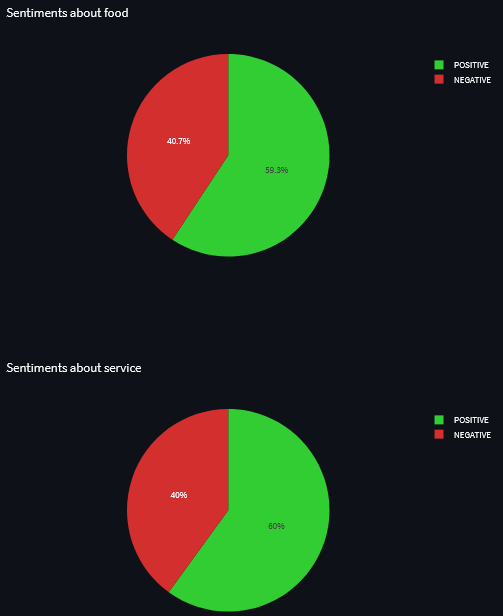
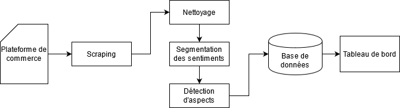
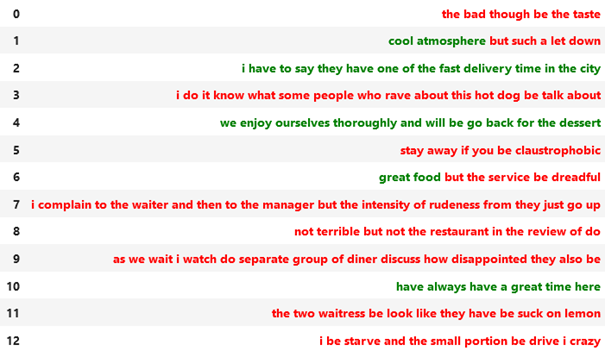
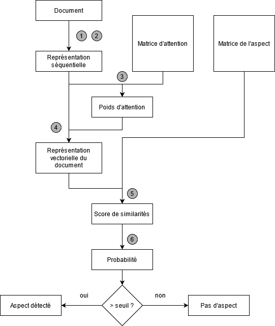

# SumOp

Summarizing the opinion of a batch of reviews by producing an instant views showing topics and sentiments.

Provides a visual summary of a batch of reviews. Given the url of a restaurant,
this module scraps a list of reviews and estimates the sentiment. Each sentence is cut
to isolate a sentiment in order to handle multi-opinionated texts. Aspects/Topics are detected within
each fragment.

# How to run it ?

* Install Docker
* Install docker-compose
* Clone this repository : ```git clone https://github.com/vesran/SumOp.git```
* Navigate to ```.../sumop```
* Run ```docker_compose up```
* Go to ```localhost:8501``` to see the dashboard.

# Application

This project runs with Streamlit and shows the sentiments for each aspect from <a href="https://www.yelp.fr/not_recommended_reviews/howlin-rays-los-angeles-3">a chosen restaurant from Yelp</a>.
The link to the reviews to collect can be customized in the ```sumop/params.py``` file under the ```URL_FORMAT``` variable.
Only Yelp can be parsed.



# Contributing

## Adding a new website

Under ```sumop/scraper```, add scripts to scrap the desired website. Data should be collected into a text file, each comment separated by ```\n```.
Change the ```PATH_TO_SAVE_SCRAPED_COMMENTS``` variable in ```sumop/params.py``` to indicate the new text file you have defined as well as the link to the website's article ```URL_FORMAT``` (```#``` indicates page number but it is only used to scrap reviews so you can customize this variable as you wish).
Next, run the app again.

## Changing the list of aspects

The list of aspects is defined in the ```sumop/params.py``` file under the variable ```ASPECTS```. This variable refers to a dictionary which maps the aspects to the minimum probability threshold which consider that a review is actually talking about the specified aspect.
Experiments should be conducted to find the optimal threshold values. If not possible, the value 0.4 is suggested. These values are independent of each others.

## Customizing the dashboard

The dashboard was built using Streamlit and Plotly. The script responsible of the dashboard is ```sumop/dashboard.py```.

# Method's details

## TL;DR
One main assumption can be underlined after analysing multiple datasets :
sentiments are usually grouped within a sentence (ie a sentence starts by positive statements and
ends with a negative review).
In order to estimate the sentiment within each aspect, a NN model is trained to
estimate the polarity of each word in a sentence. It allows us to segment sentences
with multiples sentiments. Each fragment of text may several aspects but one sentiment.
From now, it's only a matter of detecting aspects.

For more information, you can have a look at the PDF document.

## Pipeline




### Sentiment analysis



### Aspect detection

Used a modiified version of the aspect detection procedure by Tulken and Cranenburgh (2020).




# TODOs

- [X] Code
- [X] Add anasent notebook
- [X] Dashboard
- [X] Docker
- [X] Add pdf


# References
* <a href="https://arxiv.org/abs/2004.13580">Embarrassingly Simple Unsupervised Aspect Extraction</a>, 2020
